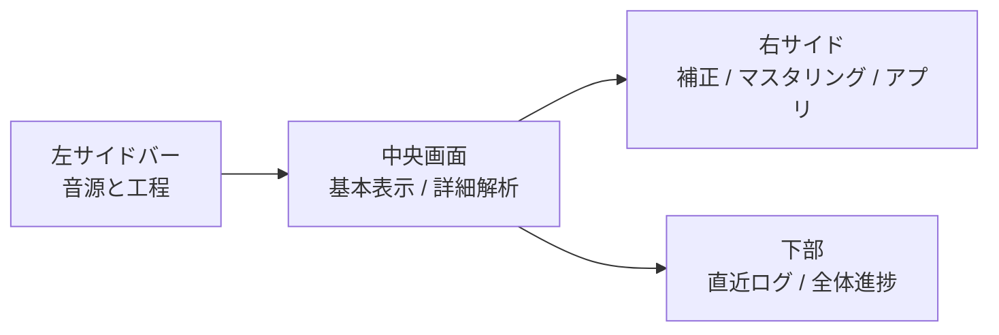
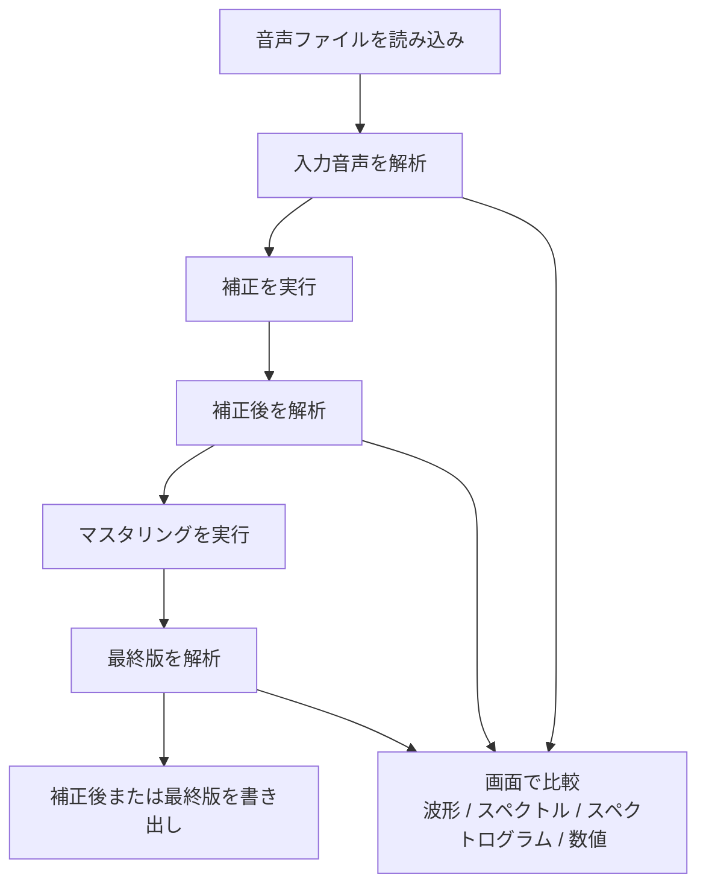

# Veloura Lucent

Veloura Lucent は、音声ファイルを読み込み、補正、マスタリング、試聴比較、解析、書き出しを行う macOS ネイティブアプリです。

コード上では、画面は `SwiftUI`、音声の読み書きは `AVFoundation`、周波数処理は `Accelerate`、グラフ表示は `Charts` を使っています。Python や Gradio は使っていません。

## 主な機能

| 分類 | 現在の機能 |
| --- | --- |
| 入力 | ツールバーの `音声を選ぶ`、または中央画面へのドラッグ＆ドロップで音声ファイルを読み込みます |
| 補正 | `弱い`、`標準`、`強い` の補正プリセットと、補正の強さ、原音保持、低域整理、芯保護などの詳細設定があります |
| マスタリング | `自然`、`聴きやすく整える`、`押し出し強め`、`安全AI配信`、`YouTube / Spotify向け`、`リリース音圧重視` の仕上がりプロファイルがあります |
| 試聴比較 | 入力、補正後、最終版を波形で確認し、A/B 再生で聴き比べます |
| 解析表示 | 平均スペクトル、ベクトルスコープ、ラウドネスメーター、スペクトログラム、詳細解析を表示します |
| 品質確認 | ラウドネス、True Peak、ダイナミクス、ステレオ幅、品質警告、完了後レポートを表示します |
| 書き出し | 補正後または最終版を、用途別の形式で保存します |
| 通知 | 補正完了、マスタリング完了を macOS 通知で知らせます |

## 画面構成



中央画面は `基本表示` と `詳細解析` に分かれています。

- `基本表示`: 波形と試聴比較、平均スペクトル、ベクトルスコープ、ラウドネスメーター、スペクトログラム
- `詳細解析`: 主要数値比較、ノイズ7種類比較、ステレオ相関、短時間ラウドネス、ダイナミクス推移、平均スペクトル比較、周波数帯域詳細

右サイドは `補正`、`マスタリング`、`アプリ` に分かれています。

- `補正`: 補正プリセット、基本、掃除と修復、上級、音声の確認
- `マスタリング`: 仕上がりプロファイル、基本、音色、上級、音声の確認
- `アプリ`: 背景の透明感、完了通知、解析モード

## 処理の流れ



補正とマスタリングの処理結果は、まずアプリ内のプレビュー用ファイルとして作られます。保存したい場合は、ツールバーの `書き出し` から形式と保存先を選びます。

## 補正処理

補正処理の進捗は、次の工程名で表示されます。

1. 読み込み
2. 解析
3. ノイズ測定
4. 低域整理
5. ノイズ除去
6. サ行保護
7. 再解析
8. 解析補助
9. 高域修復
10. 修復後シマー
11. 低中域整理
12. シマー制限
13. 高域保持
14. 低中域確認
15. ピーク保護
16. 書き出し

補正設定には、補正の強さ、原音保持、低域整理、中低域整理、プレゼンス修復、エアー修復、高域の自然さ、ノイズ検出しきい値、高域補完量、foldover 補完量、芯保護、ステレオ保護があります。

## マスタリング処理

マスタリング処理の進捗は、次の工程名で表示されます。

1. 読み込み
2. 解析
3. ノイズ基準
4. 帯域バランス
5. ハーシュネス抑制
6. 帯域制御
7. 密度調整
8. 空気感
9. ステレオ幅
10. ラウドネス
11. 高域戻り
12. ノイズ戻り
13. 高域保持
14. 最終ノイズ上限
15. 最終高域保持
16. 最終音量復帰
17. 最終ノイズ確認
18. 最終音量上限
19. 書き出し

マスタリング設定には、目標ラウドネス、True Peak 上限、低域、中低域、プレゼンス帯域、エアー帯域、ハーシュネス抑制、ステレオ幅、密度、ダイナミクス保持、仕上げの強さがあります。

## 解析と表示

| 表示 | 内容 |
| --- | --- |
| 波形と試聴比較 | 入力、補正後、最終版の波形と再生位置を表示します |
| 平均スペクトル | 入力、補正後、最終版の平均的な周波数分布を比較します |
| ベクトルスコープ | `Polar Sample`、`Polar Level`、`Lissajous` を切り替えて表示します。`Polar Level` は `RMS` と `Peak` を選べます |
| ラウドネスメーター | Momentary、Short-Term、Integrated、True Peak を表示します |
| スペクトログラム | 入力、補正後、最終版の時間ごとの周波数成分を表示します |
| 詳細解析 | 主要数値、ノイズ7種類、ステレオ相関、短時間ラウドネス、ダイナミクス、平均スペクトル、周波数帯域を表示します |

詳細解析で扱うノイズ比較は、ヒス・シュワシュワ、サ行・歯擦音、高域のチラつき、こもり・低いザラつき、ハム・電源ノイズ、低域ゴロゴロ、環境音・部屋鳴りです。

## 入力仕様

- 入力音声は `AVAudioFile` で読み込みます。
- アプリ内部の処理対象サンプルレートは 48 kHz です。
- 中央画面へのドラッグ＆ドロップは、1つの音声ファイルだけを受け付けます。
- ドロップされたファイルは、ファイル URL であり、実在するファイルであり、フォルダではなく、拡張子から判定した種類が音声である場合だけ受け付けます。

## 書き出し仕様

| メニュー名 | 形式 |
| --- | --- |
| 高品質保存 | 32-bit float WAV / 48 kHz |
| 配信・納品用 | 24-bit PCM WAV / 48 kHz |
| CD用 | 16-bit PCM WAV / 44.1 kHz + TPDFディザ |
| 試聴共有用 | AAC .m4a / 48 kHz / 256 kbps |

`書き出し` メニューには、補正後と最終版の保存項目があります。補正後や最終版のプレビューを Finder で開く項目もあります。

## 技術構成

| 項目 | 使用しているもの |
| --- | --- |
| 言語 | Swift |
| パッケージ | Swift Package Manager |
| 対応プラットフォーム | macOS 26 |
| UI | SwiftUI |
| macOS 連携 | AppKit |
| 音声読み書き | AVFoundation |
| 信号処理 | Accelerate |
| グラフ | Charts |
| ファイル種類判定 | UniformTypeIdentifiers |
| 通知 | UserNotifications |
| ログ | OSLog |
| GPU 解析 | Metal 対応時に `実験Metal` を選択可能 |

## Liquid Glass UI

アプリは macOS の透明ウィンドウ設定と SwiftUI の `glassEffect` を使っています。

- 通常のメインウィンドウは `isOpaque = false`、`backgroundColor = .clear` です。フルスクリーンまたは「透明度を下げる」が有効な時は、標準の `windowBackgroundColor` で不透明にします。
- ツールバー、タブバー、セグメント、A/B切り替え、主要ボタンなどの操作部品に `glassEffect` を使っています。
- `LiquidGlassTabBar`、`LiquidGlassSegmentedControl`、`LiquidGlassActionButton` などの共通部品があります。
- アプリ設定で、通常ウィンドウの背景の透明感を調整して保存できます。「透明度を下げる」の切り替えでは保存値を変えず、無効に戻すと元の透明感へ戻ります。
- アプリ内のスクロールバーは、各スクロール領域だけで細いOverlayとしてスクロール中に濃さを抑えて表示します。色は固定せず、macOSの外観へ適応します。「コントラストを上げる」が有効な時は、標準の濃さで表示します。

## 実行と確認

```bash
./script/build_and_run.sh
```

ビルドしたアプリを確認する場合は、次を使います。

```bash
./script/build_and_run.sh --verify
```

SwiftPM の確認は次を使います。

```bash
swift build
swift test
```

## 注意

- ラウドネス、True Peak、ノイズ値、スペクトル量は確認材料です。最終判断は試聴で行います。
- マスタリングの目標値は、必ずその数値に合わせるための命令ではなく、仕上げ意図を確認する目安です。
- `実験Metal` は対応 Mac で使う解析方式です。使えない場合は CPU 側の解析に戻ります。
- 補正後と最終版は、保存操作をするまでプレビュー用ファイルとして扱います。

## 根拠にした主なコード

- `Package.swift`
- `Sources/VelouraLucent/App/VelouraLucentApp.swift`
- `Sources/VelouraLucent/Views/ContentView.swift`
- `Sources/VelouraLucent/Views/VelouraMainWorkspaceView.swift`
- `Sources/VelouraLucent/Views/InspectorSettingsPanel.swift`
- `Sources/VelouraLucent/Views/InspectorAnalysisPanel.swift`
- `Sources/VelouraLucent/Support/InputAudioDropSupport.swift`
- `Sources/VelouraLucent/Services/AudioFileService.swift`
- `Sources/VelouraLucent/Models/AudioProcessingModels.swift`
- `Sources/VelouraLucent/Models/MasteringModels.swift`
- `Sources/VelouraLucent/Models/ProcessingProgressModels.swift`
