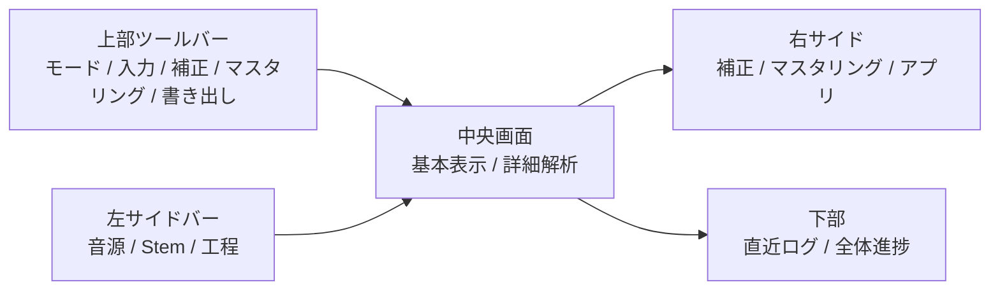
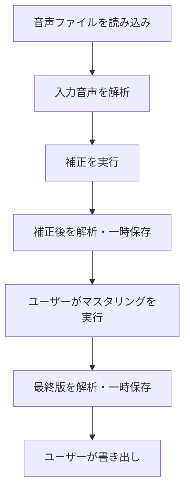
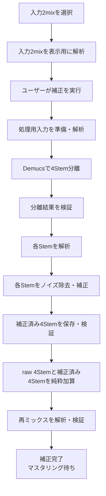
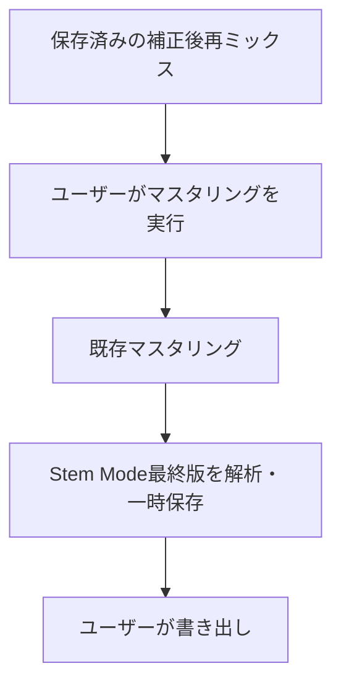

# Veloura Lucent

Veloura Lucentは、音声ファイルの解析、ノイズ除去、補正、マスタリング、試聴比較、品質確認、書き出しを行うmacOSネイティブアプリです。

アプリには、2mixをそのまま補正する`通常補正`と、2mixを4Stemへ分離してStemごとに補正する`Stem Mode`があります。どちらも、補正とマスタリングを別々のユーザー操作で実行する二段階構成です。

アプリ本体はSwiftとSwiftUIで動作し、実行時にPythonやGradioを必要としません。

## 2つのモード

| 項目 | 通常補正 | Stem Mode |
| --- | --- | --- |
| 入力 | 2mix | 2mix |
| 補正前処理 | 入力音源を解析 | 入力2mixを解析し、ドラム、ベース、その他、ボーカルへ分離 |
| 補正 | 2mixへノイズ除去と補正を実行 | Stemごとに解析し、役割に応じてノイズ除去と補正を実行 |
| 補正後 | 補正済み2mixを一時保存 | 補正済み4Stemと純粋加算した補正後2mixを一時保存 |
| マスタリング | 補正済み2mixへ実行 | 補正後2mixへ既存マスタリングを実行 |
| 最終成果物 | 通常モード最終版 | Stem Mode最終版 |
| 書き出し | 補正後、最終版 | 補正後2mix、補正済み4Stem、Stem Mode最終版 |

通常補正とStem Modeは、ツールバーまたはメニューバーの`表示 > モード`から切り替えられます。処理中はモードを切り替えません。

## 主な機能

| 分類 | 現在の機能 |
| --- | --- |
| 入力 | ツールバーの`音声を選ぶ`、または中央画面へのドラッグ＆ドロップで音声ファイルを読み込みます |
| 補正 | `弱い`、`標準`、`強い`の補正プリセットと、補正の強さ、原音保持、低域整理、芯保護などの詳細設定があります |
| Stem別補正 | ドラム、ベース、その他、ボーカルごとに補正プリセットと設定を保持します |
| マスタリング | `自然`、`聴きやすく整える`、`押し出し強め`、`安全AI配信`、`YouTube / Spotify向け`、`リリース音圧重視`の仕上がりプロファイルがあります |
| 試聴比較 | 入力、補正後、最終版をA/B再生で聴き比べます。Stem Modeでは、選択中Stemの分離直後と補正後も独立した操作欄で確認できます |
| 解析表示 | 波形、平均スペクトル、ベクトルスコープ、ラウドネスメーター、スペクトログラム、詳細解析を表示します |
| Stem固有解析 | Stemごとの測定値、役割別解析、DSPの最終適用結果、役割別guard、rawへ戻した理由を表示します |
| 再ミックス固有解析 | 再合成、残差、位相、相関、帯域、ノイズ、分離アーティファクトを確認します |
| 品質確認 | ラウドネス、True Peak、ダイナミクス、ステレオ幅、品質警告、完了後レポートを表示します |
| モデル管理 | Stem分離モデルの状態確認、再検証、取得、修復、分離条件の確認を行います |
| 書き出し | モードごとの利用可能な成果物を、用途別の形式で保存します |
| 通知 | 補正完了、マスタリング完了をmacOS通知で知らせます |

## 画面構成


```mermaid
flowchart LR
    Toolbar["上部ツールバー<br/>モード / 入力 / 補正 / マスタリング / 書き出し"]
    Sidebar["左サイドバー<br/>音源 / Stem / 工程"]
    Workspace["中央画面<br/>基本表示 / 詳細解析"]
    Inspector["右サイド<br/>補正 / マスタリング / アプリ"]
    Footer["下部<br/>直近ログ / 全体進捗"]

    Toolbar --> Workspace
    Sidebar --> Workspace
    Workspace --> Inspector
    Workspace --> Footer
```

外側の画面構成と操作方法は両モードで共通です。Stem Modeでは、通常モードの画面へStem処理に必要な表示と設定だけを追加します。

### 左サイドバー

- 入力音源、補正後、最終版を表示します。
- 補正工程とマスタリング工程を、現在の状態、進捗率、工程一覧とともに表示します。
- Stem Modeでは、4Stemの分離状態、補正状態、rawへ戻した状態も表示します。

### 中央画面

中央画面は`基本表示`と`詳細解析`に分かれています。

- `基本表示`: 波形と試聴比較、平均スペクトル、ベクトルスコープ、ラウドネスメーター、スペクトログラム
- `詳細解析`: 主要数値比較、ノイズ7種類比較、ステレオ相関、短時間ラウドネス、ダイナミクス推移、平均スペクトル比較、周波数帯域詳細

波形は、音源の正方向／負方向のピークとRMSを分けて表示します。入力、補正後、最終版の各段は共通の時間目盛りとカーソル位置を使い、カーソルまたはドラッグ位置の時刻を確認できます。

Stem Modeの基本表示には、選択したStemの`分離直後`と`補正後`を上下に表示する独立した波形・再生操作があります。この2段も共通の時間目盛りとカーソル位置を使います。

Stem Modeの詳細解析は、入力2mix、補正後再ミックス、Stem Mode最終版の共通比較を中核にし、次の開閉式表示を追加します。

- `Stem固有解析`: 4Stemそれぞれのrawと補正後の測定値、役割別解析、各DSPの最終適用結果、役割別guard、raw使用理由
- `再ミックス固有解析`: raw 4Stemと補正後4Stemの純粋加算に対する再合成、残差、位相、相関、帯域、ノイズ、分離アーティファクト

これらの解析値だけで完成音を自動選択することはありません。

### 右サイド

右サイドは`補正`、`マスタリング`、`アプリ`に分かれています。

- `補正`: 補正プリセット、基本、掃除と修復、上級
- `マスタリング`: 仕上がりプロファイル、基本設定、音色設定、詳細設定
- `アプリ`: 背景の透明感、背景ぼかしの5段階調整、完了通知、解析モード

Stem Modeの補正タブでは、ドラム、ベース、その他、ボーカルを選び、それぞれの補正設定を調整します。設定値は処理量の上限であり、解析とguardにより不要な処理は行いません。

Stem Modeのアプリタブには`Stem分離`があります。モデル状態、再検証、取得・修復、現在使用するモデルと分離条件を確認できます。

3つの設定タブの下には独立した`解析結果と品質確認`があり、入力、補正後、最終版の主要測定値、品質警告、再ミックス固有の問題、完了後レポートを表示します。

### 下部

- `直近ログ`: 最近の処理内容を最大4件表示します。
- `詳細ログ`: 補正ログとマスタリングログを分け、入力解析から完了までを工程順に表示します。
- `全体進捗`: 入力解析、補正処理、マスタリング、書き出しの状態を表示します。

## 通常補正の処理


```mermaid
flowchart TB
    A["音声ファイルを読み込み"]
    B["入力音声を解析"]
    C["補正を実行"]
    D["補正後を解析・一時保存"]
    E["ユーザーがマスタリングを実行"]
    F["最終版を解析・一時保存"]
    G["ユーザーが書き出し"]

    A --> B --> C --> D --> E --> F --> G
```

通常補正は、解析結果とユーザー設定から処理routeを決め、必要なDSPを順番に実行します。各DSPの内部guardは、処理量を弱める、安全な結果を使う、処理を省略する、または処理前の音声を維持することで音楽成分を保護します。

### 補正工程

1. 読み込み
2. 解析
3. ノイズ測定
4. 低域整理
5. ノイズ除去
6. サ行保護
7. 再解析
8. 解析補助
9. 高域修復
10. 修復後シマー
11. 低中域整理
12. シマー制限
13. 高域保持
14. 低中域確認
15. ピーク保護
16. 書き出し

補正設定には、補正の強さ、原音保持、低域整理、中低域整理、プレゼンス修復、エアー修復、高域の自然さ、ノイズ検出しきい値、高域補完量、foldover補完量、芯保護、ステレオ保護があります。

### マスタリング工程

1. 読み込み
2. 解析
3. ノイズ基準
4. 帯域バランス
5. ハーシュネス抑制
6. 帯域制御
7. 密度調整
8. 空気感
9. ステレオ幅
10. ラウドネス
11. 高域戻り
12. ノイズ戻り
13. 高域保持
14. 最終ノイズ上限
15. 最終高域保持
16. 最終音量復帰
17. 最終ノイズ確認
18. 最終音量上限
19. 書き出し

マスタリング設定には、目標ラウドネス、True Peak上限、低域、中低域、プレゼンス帯域、エアー帯域、ハーシュネス抑制、ステレオ幅、密度、ダイナミクス保持、仕上げの強さがあります。

## Stem Modeの処理

Stem Modeも、補正とマスタリングを一度に実行しません。

### 補正段


```mermaid
flowchart TB
    A["入力2mixを選択"]
    B["入力2mixを表示用に解析"]
    C["ユーザーが補正を実行"]
    D["処理用入力を準備・解析"]
    E["Demucsで4Stem分離"]
    F["分離結果を検証"]
    G["各Stemを解析"]
    H["各Stemをノイズ除去・補正"]
    I["補正済み4Stemを保存・検証"]
    J["raw 4Stemと補正済み4Stemを純粋加算"]
    K["再ミックスを解析・検証"]
    L["補正完了<br/>マスタリング待ち"]

    A --> B --> C --> D --> E --> F --> G --> H --> I --> J --> K --> L
```

AIモデルの役割は4Stem分離までです。分離後は、通常モードで使用している解析、NoiseMeasurement、route、下位DSP、DSP内部guardを中核にし、Stemの役割別解析と保護guardを追加します。

入力2mixの表示用解析は、通常モードと同じく音源を選択した時点で開始します。補正開始後の処理用解析は、Demucsへ渡す44.1 kHz音源とその後の検証に使用します。

4Stemは次の役割で処理します。

- `ドラム`: アタック、トランジェント、シンバルの余韻を保護
- `ベース`: 基音、倍音、50/60 Hz付近の音程成分、低域位相を保護
- `その他`: 残響、アンビエンス、空間、ステレオ感を保護
- `ボーカル`: 息、子音、サ行、フォルマント、倍音、声の芯を保護

処理は複数の完成候補を生成して選ぶ方式ではありません。各Stemの解析結果と設定から、一本道で`実行`、`弱めて実行`、`省略`を決めます。

Stem役割別guardで問題を検出した場合は、次の順で安全側へ戻します。

1. 問題区間のDSP差分を弱める
2. 問題のあるDSPだけを省略する
3. そのDSPの処理直前音声を維持する
4. 必要な場合だけ該当Stemをrawへ戻す
5. 4Stemを再ミックスして再検証する

### マスタリング段


```mermaid
flowchart TB
    A["保存済みの補正後再ミックス"]
    B["ユーザーがマスタリングを実行"]
    C["既存マスタリング"]
    D["Stem Mode最終版を解析・一時保存"]
    E["ユーザーが書き出し"]

    A --> B --> C --> D --> E
```

Stem Mode専用の簡易マスタリングには置き換えず、通常モードと同じ既存マスタリングを使用します。Stem単体ではピークを一律に制限せず、純粋加算した補正後2mixをマスタリングする段階でピークとラウドネスを制御します。

## Stem分離モデル

Stem ModeはApple Silicon上のMLXで`Demucs v4 htdemucs`を実行します。通常補正はStemモデルを必要としません。

| 項目 | 現在の仕様 |
| --- | --- |
| モデル | Demucs v4 htdemucs |
| モデル取得元 | Hugging Faceの固定Revision |
| ダウンロード資産 | `htdemucs.safetensors`、`htdemucs_config.json` |
| MLX実行資産 | `mlx.metallib`をアプリへ同梱 |
| 分離結果 | ドラム、ベース、その他、ボーカル |
| shifts / overlap | `1 / 0.25` |
| split / segment | `true / 7.8秒` |
| batch size | `1` |
| seed | 入力選択時に生成し、同じ処理内で保持 |

モデル管理は右サイドの`アプリ > Stem分離`で行います。

- `モデル状態`: 確認中、利用可能、未取得、修復が必要、実行資産異常などを表示
- `モデル検証`: ローカル資産をネットワークへ接続せず再検証
- `モデル取得・修復`: 取得内容の確認画面を表示し、ユーザーが承認した場合だけダウンロード

取得したモデルは、容量、固定Revision、SHA-256を検証してから有効化します。モデル取得や修復は音楽処理経路とは分離されており、補正開始時に再ダウンロードしません。

## 解析と表示

| 表示 | 内容 |
| --- | --- |
| 波形と試聴比較 | 入力、補正後、最終版の正負ピークとRMS、再生位置、共通時間目盛り、カーソル時刻を表示します |
| Stem波形比較 | 選択中Stemの分離直後と補正後を、共通時間目盛り、カーソル時刻、独立した再生操作とともに上下表示します |
| 平均スペクトル | 入力、補正後、最終版の平均的な周波数分布を比較します |
| ベクトルスコープ | `Polar Sample`、`Polar Level`、`Lissajous`を切り替えて表示します。`Polar Level`は`RMS`と`Peak`を選べます |
| ラウドネスメーター | Momentary、Short-Term、Integrated、True Peakを表示します |
| スペクトログラム | 入力、補正後、最終版の時間ごとの周波数成分を表示します |
| 詳細解析 | 主要数値、ノイズ7種類、ステレオ相関、短時間ラウドネス、ダイナミクス、平均スペクトル、周波数帯域を表示します |
| Stem固有解析 | raw／補正後Stemの測定値、役割別解析、DSP適用結果、役割別guardを表示します |
| 再ミックス固有解析 | 再合成、残差、位相、相関、帯域、ノイズ、分離アーティファクトを表示します |

詳細解析で扱うノイズ比較は、ヒス・シュワシュワ、サ行・歯擦音、高域のチラつき、こもり・低いザラつき、ハム・電源ノイズ、低域ゴロゴロ、環境音・部屋鳴りです。

測定値は、明確な破損や異常を防ぎ、処理の結果を確認するために使います。数値が変化したことだけを劣化とは判断せず、数値だけで完成音を自動選択しません。

## 入力仕様

- 入力音声は`AVAudioFile`で読み込みます。
- アプリ内部の通常処理対象サンプルレートは48 kHzです。
- Stem分離用の正本は、検証済みモデル契約に合わせて44.1 kHz、stereo、Float32で準備します。
- 中央画面へのドラッグ＆ドロップは、1つの音声ファイルだけを受け付けます。
- ドロップされたファイルは、ファイルURLであり、実在するファイルであり、フォルダではなく、拡張子から判定した種類が音声である場合だけ受け付けます。

## 一時ファイルとキャンセル

処理結果は、ユーザーが`書き出し`を行うまでプレビュー用の一時ファイルとして扱います。

### 通常補正

- 新しい入力を選ぶと、以前の補正後と最終版のプレビューを破棄します。
- 補正をキャンセルすると、補正段の未完了結果を破棄します。
- マスタリングをキャンセルすると、補正後を保持し、マスタリング段だけを戻します。

### Stem Mode

- 現在のセッションで必要なWAVだけを`VelouraLucentStemPreview`以下へ保存します。
- 補正をキャンセルすると、その補正セッションの分離・補正・再ミックス成果物を破棄し、選択中の入力2mixは維持します。
- マスタリングをキャンセルすると、補正済み4Stemと補正後再ミックスを保持し、再びマスタリングを実行できる状態へ戻します。
- 新しい入力を選んだ時とアプリ終了時に、現在のStemセッションを破棄します。
- 履歴、run再開、checkpoint、複数候補の保存は行いません。

## 書き出し仕様

### 保存形式

| メニュー名 | 形式 |
| --- | --- |
| 高品質保存 | 32-bit float WAV / 48 kHz |
| 配信・納品用 | 24-bit PCM WAV / 48 kHz |
| CD用 | 16-bit PCM WAV / 44.1 kHz + TPDFディザ |
| 試聴共有用 | AAC .m4a / 48 kHz / 256 kbps |

### 書き出せる成果物

| モード | 成果物 |
| --- | --- |
| 通常補正 | 補正後、最終版 |
| Stem Mode | 補正後再ミックス、補正済みドラム、補正済みベース、補正済みその他、補正済みボーカル、最終マスター |

内部処理用の入力変換音源、raw Stem、raw再ミックス、検証用成果物は書き出しメニューへ表示しません。

## 技術構成

| 項目 | 使用しているもの |
| --- | --- |
| 言語 | Swift 6.2 |
| パッケージ | Swift Package Manager |
| 対応プラットフォーム | macOS 26 |
| UI | SwiftUI |
| macOS連携 | AppKit |
| 音声読み書き | AVFoundation |
| 信号処理 | Accelerate |
| グラフ | Charts |
| ファイル種類判定 | UniformTypeIdentifiers |
| 通知 | UserNotifications |
| ログ | OSLog |
| 通常解析 | CPU、対応Macでは`実験Metal`を選択可能 |
| Stem分離 | Demucs v4 htdemucs、MLX Swift、Metal |
| Demucs実装 | `Vendor/demucs-mlx-swift`の`DemucsMLX` |
| SwiftPM依存 | `swift-collections 1.4.0` |
| Stem資産 | モデル契約とMLX実行資産を`Resources/StemModels`へ同梱 |

通常モードの`実験Metal`解析と、Stem ModeのMLXによるDemucs分離は別の処理です。

## Liquid Glass UI

アプリはmacOSの透明ウィンドウ設定とSwiftUIの`glassEffect`を使っています。

- 通常のメインウィンドウは`isOpaque = false`、`backgroundColor = .clear`です。フルスクリーンまたは「透明度を下げる」が有効な時は、標準の`windowBackgroundColor`で不透明にします。
- ツールバー、タブバー、セグメント、A/B切り替え、主要ボタンなどの操作部品に`glassEffect`を使っています。
- `LiquidGlassTabBar`、`LiquidGlassSegmentedControl`、`LiquidGlassActionButton`などの共通部品があります。
- アプリ設定で、通常ウィンドウの背景の透明感と、背景ぼかしの5段階調整を別々に保存できます。ぼかし調整は5つの目盛りと段階名を表示し、ノブは各目盛りの位置だけに止まります。OFFなら従来と同じ`thin`を使い、ONなら5段階から選んだ素材を使います。OFFにしても選択した段階は保持され、再びONにすると復元されます。「透明度を下げる」の切り替えでは保存値を変えず、無効に戻すと元の透明感とぼかし設定へ戻ります。
- アプリ内のスクロールバーは、各スクロール領域だけで細いOverlayとしてスクロール中に濃さを抑えて表示します。色は固定せず、macOSの外観へ適応します。「コントラストを上げる」が有効な時は、標準の濃さで表示します。

## 実行と確認

アプリをビルドして起動する場合は、次を使います。

```bash
./script/build_and_run.sh
```

ビルド済みアプリ、Stemモデル契約、同梱MLX実行資産などを確認する場合は、次を使います。

```bash
./script/build_and_run.sh --verify
```

SwiftPMの確認は次を使います。

```bash
swift build
swift test
```

## 注意

- ラウドネス、True Peak、ノイズ値、スペクトル量は確認材料です。最終判断は試聴で行います。
- マスタリングの目標値は、必ずその数値に合わせる命令ではなく、仕上げ意図を確認する目安です。
- `実験Metal`は対応Macで使う通常解析方式です。使えない場合はCPU側の解析に戻ります。
- Stem ModeはApple SiliconのMLX実行環境を使用します。Stem Modeを利用できない場合でも、通常補正は利用できます。
- Stemモデルの取得、再取得、修復にはネットワーク接続が必要です。ローカルのモデル検証にはネットワーク接続を使いません。
- 補正後、補正済みStem、最終版は、ユーザーが書き出すまで一時ファイルです。

## 根拠にした主なコード

### アプリと共通画面

- `Package.swift`
- `Sources/VelouraLucent/App/VelouraLucentApp.swift`
- `Sources/VelouraLucent/App/VelouraAppRuntime.swift`
- `Sources/VelouraLucent/App/VelouraCommands.swift`
- `Sources/VelouraLucent/Views/VelouraRootView.swift`
- `Sources/VelouraLucent/Views/WorkspaceToolbarView.swift`
- `Sources/VelouraLucent/Views/WorkspaceShellView.swift`
- `Sources/VelouraLucent/Services/AudioFileService.swift`

### 通常補正

- `Sources/VelouraLucent/Models/ProcessingJob.swift`
- `Sources/VelouraLucent/Models/ProcessingProgressModels.swift`
- `Sources/VelouraLucent/Models/AudioProcessingModels.swift`
- `Sources/VelouraLucent/Models/MasteringModels.swift`
- `Sources/VelouraLucent/Services/NativeAudioProcessor.swift`
- `Sources/VelouraLucent/Services/MasteringService.swift`
- `Sources/VelouraLucent/Views/VelouraMainWorkspaceView.swift`
- `Sources/VelouraLucent/Views/InspectorSettingsPanel.swift`
- `Sources/VelouraLucent/Views/InspectorAnalysisPanel.swift`

### Stem Mode

- `Sources/VelouraLucent/Models/StemWorkflowController.swift`
- `Sources/VelouraLucent/Models/StemWorkflowModels.swift`
- `Sources/VelouraLucent/Models/StemModeWorkspaceModel.swift`
- `Sources/VelouraLucent/Services/StemWorkflowService.swift`
- `Sources/VelouraLucent/Services/StemSeparationService.swift`
- `Sources/VelouraLucent/Services/StemCorrectionService.swift`
- `Sources/VelouraLucent/Services/StemRoleAnalysisService.swift`
- `Sources/VelouraLucent/Services/StemRoleProtectionGuardService.swift`
- `Sources/VelouraLucent/Services/StemRemixSafetyGuardService.swift`
- `Sources/VelouraLucent/Services/StemValidationService.swift`
- `Sources/VelouraLucent/Services/StemMasteringService.swift`
- `Sources/VelouraLucent/Views/StemModeWorkspaceView.swift`
- `Sources/VelouraLucent/Views/StemModeSidebarView.swift`
- `Sources/VelouraLucent/Views/StemModeInspectorView.swift`
- `Sources/VelouraLucent/Views/StemModeDetailedAnalysisWorkspaceView.swift`
- `Sources/VelouraLucent/Views/StemWaveformComparisonView.swift`
- `Sources/VelouraLucent/Views/StemModelManagementSection.swift`
