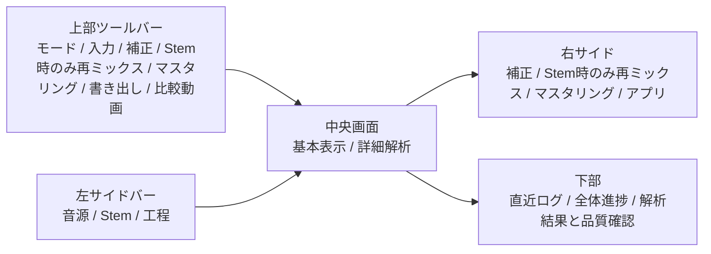
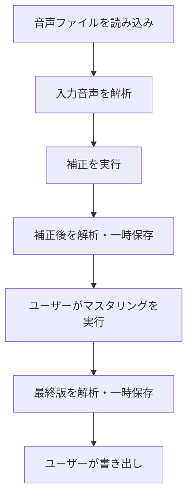
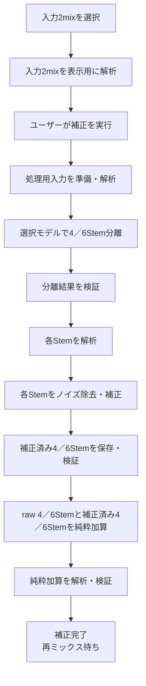
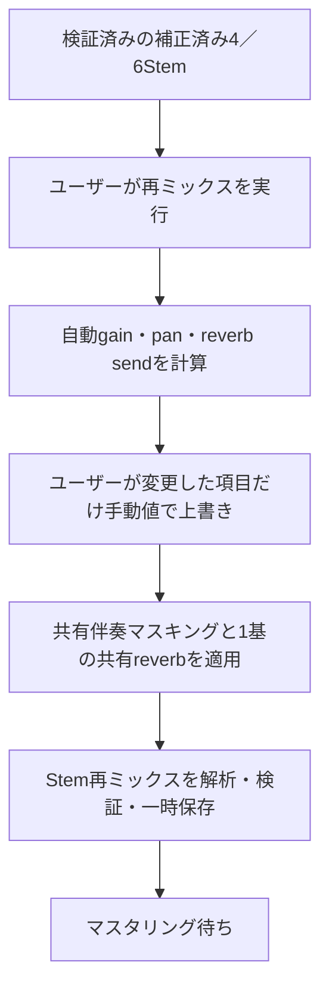
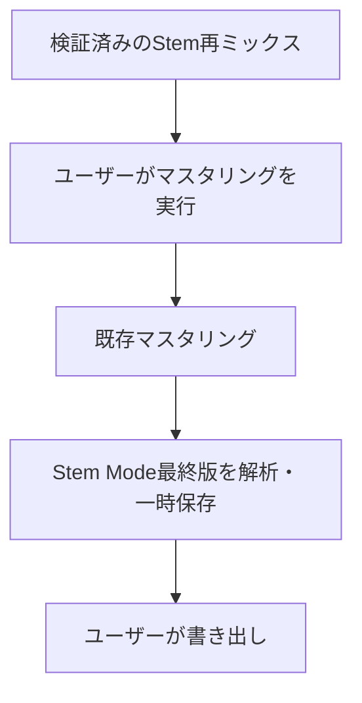

# Veloura Lucent（ヴェルーラ・ルーセント）

Veloura Lucentは、音源の解析、ノイズ除去、適応型補正・マスタリング、試聴比較、品質確認、書き出しを行うmacOSネイティブアプリです。標準的なチャンネル構成のマルチチャンネル音源は自動でステレオへ変換し、内部のモノラル／ステレオ信号に対するラウドネス測定は`ITU-R BS.1770-5 Annex 1`に準拠しています。

アプリには、2mixをそのまま補正する`通常補正`と、選択モデルの契約に従って2mixを4Stemまたは6Stemへ分離し、Stemごとに補正する`Stem Mode`があります。通常補正は補正とマスタリングの二段階、Stem Modeは補正、再ミックス、マスタリングの三段階を別々のユーザー操作で実行します。

アプリ本体はSwiftとSwiftUIで動作し、実行時にPythonやGradioを必要としません。

## 適応型補正・マスタリング

Veloura Lucentの補正・マスタリングは適応型です。アプリが読み込んだ音源の状態を判断し、ユーザーが選んだ仕上げ方を基準として、その音源に必要な処理だけを必要な量で実行します。

補正プリセットとマスタリングの仕上がりプロファイルは、すべての音源へ同じ処理値を固定して適用するものではありません。アプリが処理の必要性を判断するための基準と、適用できる処理量の範囲を指定します。そのため、同じ設定を選んでも、音源に応じて実行する処理と適用量が変わります。

アプリは、元から整っている部分には不要な処理を加えず、調整が必要な部分だけを処理します。処理によって音楽成分を損なう場合は、適用量を弱める、処理を省略する、または処理前の音を維持します。

## 2つのモード

| 項目 | 通常補正 | Stem Mode |
| --- | --- | --- |
| 入力 | 2mix | 2mix |
| 補正前処理 | 入力音源を解析 | 入力2mixを解析し、HTDemucsでは4Stem、BS-RoFormer-SWではGuitar／Pianoを含む6Stemへ分離 |
| 補正 | 2mixへノイズ除去と補正を実行 | Stemごとに解析し、役割に応じてノイズ除去と補正を実行 |
| 補正後 | 補正済み2mixを一時保存 | 補正済み4／6Stemと、係数・正規化・pan・dynamics・limiterなしの純粋加算を一時保存 |
| 再ミックス | なし | 全有効Stemのgain、pan、reverb send、自動値と手動上書きを適用し、検証済み再ミックスを一時保存 |
| マスタリング | 補正済み2mixへ実行 | 検証済みStem再ミックスへ既存マスタリングを実行 |
| 最終成果物 | 通常モード最終版 | Stem Mode最終版 |
| 書き出し | 補正後、最終版 | 補正後、Stem再ミックス、補正済み4／6Stem、Stem Mode最終版 |

通常補正とStem Modeは、ツールバーまたはメニューバーの`表示 > モード`から切り替えられます。処理中はモードを切り替えません。

## 主な機能

| 分類 | 現在の機能 |
| --- | --- |
| 入力 | ツールバーの`音声を選ぶ`、または中央画面へのドラッグ＆ドロップで音声ファイルを読み込みます |
| 補正 | `弱い`、`標準`、`強い`の補正プリセットと、補正の強さ、原音保持、低域整理、芯保護などの詳細設定があります |
| Stem別補正 | HTDemucsのドラム、ベース、その他、ボーカル、またはBS-RoFormer-SWのベース、ドラム、その他、ボーカル、ギター、ピアノごとに補正プリセットと設定を保持します |
| Stem再ミックス | 全有効Stemに個別gain、pan、reverb sendを持ち、自動値とユーザーが変更した項目だけの手動値を使います |
| マスタリング | `自然`、`聴きやすく整える`、`押し出し強め`、`安全AI配信`、`YouTube / Spotify向け`、`リリース音圧重視`の仕上がりプロファイルがあります |
| 試聴比較 | 入力、処理後、最終版を同じ再生位置のままA/B再生で聴き比べます。選択中の比較対象は波形色でも確認できます。Stem Modeでは、選択中Stemの分離直後と補正後、再ミックス前後も、それぞれ独立した操作欄で確認できます |
| 解析表示 | 波形、平均スペクトル、ベクトルスコープ、ラウドネスメーター、スペクトログラム、詳細解析を表示します |
| Stem固有解析 | Stemごとの測定値、役割別解析、DSPの最終適用結果、役割別guard、rawへ戻した理由を表示します |
| 再ミックス固有解析 | 再合成、残差、位相、相関、帯域、ノイズ、分離アーティファクトを確認します |
| 品質確認 | ラウドネス、True Peak、ダイナミクス、ステレオ幅、品質確認、完了後レポートを表示します |
| モデル管理 | Stem分離モデルの状態確認、再検証、取得、修復、分離条件の確認を行います |
| 書き出し | モードごとの利用可能な成果物を、用途別の形式で保存します |
| 比較動画 | 入力と利用可能な処理結果から2つを選び、表示内容を調整して横長または縦長の比較動画を書き出します |
| キーボード操作 | ファイル、処理、再生、比較、表示、設定などのショートカットを変更・削除・初期化し、固定操作キーも確認できます |
| 通知 | アプリ通知の全体設定と、通常補正、通常マスタリング、Stem Mode補正、Stem Modeマスタリングの項目別設定に従ってmacOS通知を送ります |

## 画面構成


```mermaid
flowchart LR
    Toolbar["上部ツールバー<br/>モード / 入力 / 補正 / Stem時のみ再ミックス / マスタリング / 書き出し / 比較動画"]
    Sidebar["左サイドバー<br/>音源 / Stem / 工程"]
    Workspace["中央画面<br/>基本表示 / 詳細解析"]
    Inspector["右サイド<br/>補正 / Stem時のみ再ミックス / マスタリング / アプリ"]
    Footer["下部<br/>直近ログ / 全体進捗 / 解析結果と品質確認"]

    Toolbar --> Workspace
    Sidebar --> Workspace
    Workspace --> Inspector
    Workspace --> Footer
```

外側の画面構成とツールバーは両モードで共通です。左サイドバー、中央画面、右サイド、下部はモード別の専用画面へ切り替わります。

### 左サイドバー

- 通常補正では、入力音源、補正後、最終版を表示します。
- Stem Modeでは、入力2mix、補正後、Stem再ミックス、Stem Mode最終版を表示します。
- 各モードの工程を、現在の状態、進捗率、工程一覧とともに表示します。Stem Modeでは、選択モデルに対応する4／6Stemの分離状態、補正状態、rawへ戻した状態も表示します。

### 中央画面

中央画面は`基本表示`と`詳細解析`に分かれています。

- `基本表示`: 波形と試聴比較、平均スペクトル、ベクトルスコープ、ラウドネスメーター、スペクトログラム
- `詳細解析`: 主要数値比較、ノイズ7種類比較、ステレオ相関、短時間ラウドネス、ダイナミクス推移、平均スペクトル比較、周波数帯域詳細

波形は、音源の正方向／負方向のピークとRMSを縦方向の区間として表示します。入力、補正後、最終版の各段は共通の時間目盛りとカーソル位置を使います。各段は初期状態で96 ptの高さがあり、下端のハンドルを上下へドラッグすると68〜192 ptの範囲で個別に高さを変えられます。波形をクリックすると再生位置を移動し、拡大中に左右へドラッグすると波形の表示範囲をスクロールできます。ドラッグは表示だけを動かし、再生位置や音声処理は変更しません。時間目盛りの右下にあるズームスライダーと縮小／拡大ボタンで、現在の再生位置を中心に連続的に表示範囲を変えられ、3段の表示範囲は常に揃います。曲の先頭では右方向、途中では左右、末尾では左方向へ表示範囲が広がります。最大倍率は、保持している波形データを表示幅より粗く引き伸ばさない範囲で決まります。拡大したまま再生すると、先頭と末尾を除いて再生位置を画面内へ保ちながら波形が連続して流れます。

Stem Modeの基本表示には、選択したStemの`分離直後`と`補正後`を上下に表示する独立した波形・再生操作があります。この2段も初期高さは96 ptで、それぞれ下端から個別に高さを変えられます。共通の時間目盛り、カーソル位置、再生位置を中心にした拡大率を使い、通常モードの波形拡大状態とは別に管理され、Stemを切り替えると全体表示へ戻ります。

補正後とStem再ミックスにも、2段の波形と専用のA/B再生操作があります。A/Bを切り替えても再生位置を維持し、選択中の比較対象だけを波形本来の色で表示します。試聴時だけ音量差を揃え、保存した音声は変更しません。

選択中Stem、または補正後とStem再ミックスの比較を再生している間は、中央の平均スペクトルとベクトルスコープも、その試聴欄で再生している音源を表示します。

Stem Modeの詳細解析は、入力2mix、現在の処理後音源（補正後または実行済みStem再ミックス）、Stem Mode最終版の共通比較を中核にし、次の開閉式表示を追加します。

- `Stem固有解析`: 実行契約の4／6Stemそれぞれのrawと補正後の測定値、役割別解析、各DSPの最終適用結果、役割別guard、raw使用理由
- `再ミックス固有解析`: raw 4／6Stem、補正後、実行済み再ミックスに対する再合成、残差、位相、相関、帯域、ノイズ、分離アーティファクト

これらの解析値だけで完成音を自動選択することはありません。

### 右サイド

通常補正の右サイドは`補正`、`マスタリング`、`アプリ`に分かれています。Stem Modeでは、その間に`再ミックス`が加わります。

- `補正`: 補正プリセット、基本、掃除と修復、上級
- `再ミックス`（Stem Modeのみ）: Stem別の音量、パン、共通リバーブへの送信量、Stem間の衝突回避、共通リバーブの戻り量
- `マスタリング`: 仕上がりプロファイル、基本設定、音色設定、詳細設定
- `アプリ`: 背景の透明感、背景ぼかしの5段階調整、完了通知、キーボード操作、解析モード

Stem Modeの補正タブでは、HTDemucsなら4役割、BS-RoFormer-SWならGuitar／Pianoを含む6役割から選び、それぞれの補正設定を調整します。設定値は処理量の上限であり、解析とguardにより不要な処理は行いません。

Stem Modeのアプリタブには`Stem分離`があります。モデル状態、再検証、取得・修復、現在使用するモデルと分離条件を確認できます。

### 下部

下部は中央画面から右端まで続く固定領域です。右サイドの設定を表示・非表示にしても、ログ、進捗、解析結果の位置関係を維持します。

- `直近ログ`: 最近の処理内容を最大4件表示します。
- `詳細ログ`: 補正、再ミックス、マスタリングのログを分け、入力解析から完了までを工程順に表示します。
- `全体進捗`: 入力解析、補正処理、再ミックス、マスタリング、書き出しの状態を表示します。
- `解析結果と品質確認`: 固定下部領域の右側で、入力、処理後、最終版の主要測定値、品質確認、Stem Modeでは再ミックス固有の確認事項、完了後レポートを表示します。

## キーボード操作

右サイドの`アプリ > キーボード操作`から管理画面を開き、`変更できるショートカット`と`固定の操作キー`を切り替えて確認します。

変更できるショートカットは、`ファイル`、`処理`、`再生`、`比較対象`、`モード`、`中央表示`、`波形`、`右側設定`、`解析結果`、`ウインドウ`のカテゴリーに分かれています。各カテゴリーの項目を一つの角丸枠へまとめ、複数項目の間に区切り線を表示します。

- 各操作のショートカットを設定・変更できます。
- ショートカットを未設定にしたり、その操作だけを初期設定へ戻したりできます。
- `すべて初期設定へ戻す`で、変更できるショートカット全体を初期状態へ戻せます。
- ほかの変更可能な操作やmacOS標準の固定操作と重なるキーは保存しません。
- 変更内容は保存され、次回起動後もメニュー、ツールバー、再生、表示切り替えなどの操作に使われます。

固定の操作キーでは、アプリ、ウインドウ、文字入力に加えて、ロータリーノブ、拡大中の波形、スライダー、ボタン・タブ・開閉項目、確認画面、VoiceOverの操作を確認できます。固定操作もカテゴリーごとの角丸枠と項目間の区切り線で表示し、変更対象にはしません。

## 完了通知

右サイドの`アプリ > 通知`には、macOSの通知許可状態と、通知全体を切り替える`アプリ通知`、次の4つの通知項目があります。各項目は一つの角丸枠にまとめ、項目間へ区切り線を表示します。

- 通常補正
- 通常マスタリング
- Stem Mode補正
- Stem Modeマスタリング

完了通知は、`アプリ通知`と対応する通知項目が両方ONの時だけ送ります。新規利用時の`アプリ通知`はOFF、4つの通知項目はONです。`アプリ通知`がOFFの間は項目別スイッチを操作できませんが、保存済みの項目設定は維持します。

アプリ起動時にはmacOSへ通知許可を求めません。利用者が`アプリ通知`をONにした時だけ許可を確認し、まだ選択されていなければmacOSの許可画面を表示します。アプリ設定では、許可済みを緑、未許可を赤で表示します。

通知が未許可の場合は案内を表示し、システム設定にあるVeloura Lucentの個別通知設定を優先して開きます。個別設定を開けない場合は、従来の通知一覧を開きます。

## 通常補正の処理


```mermaid
flowchart TB
    A["音声ファイルを読み込み"]
    B["入力音声を解析"]
    C["補正を実行"]
    D["補正後を解析・一時保存"]
    E["ユーザーがマスタリングを実行"]
    F["最終版を解析・一時保存"]
    G["ユーザーが書き出し"]

    A --> B --> C --> D --> E --> F --> G
```

通常補正は、解析結果とユーザー設定から処理routeを決め、必要なDSPを順番に実行します。各DSPの内部guardは、処理量を弱める、安全な結果を使う、処理を省略する、または処理前の音声を維持することで音楽成分を保護します。

### 補正工程

1. 読み込み
2. 解析
3. ノイズ測定
4. 低域整理
5. ノイズ除去
6. サ行保護
7. 再解析
8. 解析補助
9. 高域修復
10. 修復後シマー
11. 低中域整理
12. シマー制限
13. 高域保持
14. 低中域確認
15. 低域位相確認
16. ピーク保護
17. 書き出し

補正設定には、補正の強さ、原音保持、低域整理、中低域整理、プレゼンス修復、エアー修復、高域の自然さ、ノイズ検出しきい値、高域補完量、foldover補完量、芯保護、ステレオ保護があります。

### マスタリング工程

1. 読み込み
2. 解析
3. ノイズ基準
4. 帯域バランス
5. ハーシュネス抑制
6. 帯域制御
7. 密度調整
8. 空気感
9. ステレオ幅
10. ラウドネス
11. 高域戻り
12. ノイズ戻り
13. 高域保持
14. 最終ノイズ上限
15. 最終高域保持
16. 最終音量復帰
17. 最終ノイズ確認
18. 最終音量上限
19. 書き出し

マスタリング設定には、目標ラウドネス、True Peak上限、低域、中低域、プレゼンス帯域、エアー帯域、ハーシュネス抑制、ステレオ幅、密度、ダイナミクス保持、仕上げの強さがあります。

## Stem Modeの処理

Stem Modeは、補正、再ミックス、マスタリングを一度に実行しません。

### 補正段


```mermaid
flowchart TB
    A["入力2mixを選択"]
    B["入力2mixを表示用に解析"]
    C["ユーザーが補正を実行"]
    D["処理用入力を準備・解析"]
    E["選択モデルで4／6Stem分離"]
    F["分離結果を検証"]
    G["各Stemを解析"]
    H["各Stemをノイズ除去・補正"]
    I["補正済み4／6Stemを保存・検証"]
    J["raw 4／6Stemと補正済み4／6Stemを純粋加算"]
    K["純粋加算を解析・検証"]
    L["補正完了<br/>再ミックス待ち"]

    A --> B --> C --> D --> E --> F --> G --> H --> I --> J --> K --> L
```

AIモデルの役割は、HTDemucsでは4Stem、BS-RoFormer-SWでは6Stemの分離までです。分離後は、通常モードで使用している解析、NoiseMeasurement、route、下位DSP、DSP内部guardを中核にし、Stemの役割別解析と保護guardを追加します。

入力2mixの表示用解析は、通常モードと同じく音源を選択した時点で開始します。補正開始後の処理用解析は、選択モデルへ渡す44.1 kHz音源とその後の検証に使用します。

Stemは次の役割で処理します。GuitarとPianoはBS-RoFormer-SWの6Stem実行時だけ有効です。

- `ドラム`: アタック、トランジェント、シンバルの余韻を保護
- `ベース`: 基音、倍音、50/60 Hz付近の音程成分、低域位相を保護
- `その他`: 残響、アンビエンス、空間、ステレオ感を保護
- `ボーカル`: 息、子音、サ行、フォルマント、倍音、声の芯を保護
- `ギター`: ピッキング／アタック、調波・音色本体、高域ディテール、周波数別減衰、ステレオを専用解析して保護
- `ピアノ`: ハンマーアタック、部分音・非調波性、周波数別余韻・二段減衰、広帯域バランス、ステレオを専用解析して保護

処理は複数の完成候補を生成して選ぶ方式ではありません。各Stemの解析結果と設定から、一本道で`実行`、`弱めて実行`、`省略`を決めます。

Stem役割別guardで問題を検出した場合は、次の順で安全側へ戻します。

1. 問題区間のDSP差分を弱める
2. 問題のあるDSPだけを省略する
3. そのDSPの処理直前音声を維持する
4. 必要な場合だけ該当Stemをrawへ戻す
5. 全有効Stemを契約順に純粋加算して再検証する

### 再ミックス段


```mermaid
flowchart TB
    A["検証済みの補正済み4／6Stem"]
    B["ユーザーが再ミックスを実行"]
    C["自動gain・pan・reverb sendを計算"]
    D["ユーザーが変更した項目だけ手動値で上書き"]
    E["共有伴奏マスキングと1基の共有reverbを適用"]
    F["Stem再ミックスを解析・検証・一時保存"]
    G["マスタリング待ち"]

    A --> B --> C --> D --> E --> F --> G
```

HTDemucsは従来のDrums→BassとVocals→Otherを維持します。BS-RoFormer-SWでは、Other／Guitar／Pianoの伴奏バスからVocalsとの衝突を1回判定し、同じ制御を3本へ適用して相対バランスを維持します。全Stemのreverb sendは1基の共有reverbへ入り、returnは1本だけdry合計へ戻します。

### マスタリング段


```mermaid
flowchart TB
    A["検証済みのStem再ミックス"]
    B["ユーザーがマスタリングを実行"]
    C["既存マスタリング"]
    D["Stem Mode最終版を解析・一時保存"]
    E["ユーザーが書き出し"]

    A --> B --> C --> D --> E
```

Stem Mode専用の簡易マスタリングには置き換えず、通常モードと同じ既存マスタリングを使用します。Stem単体ではピークを一律に制限せず、検証済みStem再ミックスをマスタリングする段階でピークとラウドネスを制御します。

## Stem分離モデル

Stem ModeはApple Silicon上のMLXで`HTDemucs`または`BS-RoFormer-SW`を実行します。通常補正はStemモデルを必要としません。

| 項目 | HTDemucs | BS-RoFormer-SW |
| --- | --- | --- |
| モデル取得元 | Hugging Faceの固定Revision | Hugging Faceの固定Revision |
| ダウンロード資産 | `htdemucs.safetensors`、`htdemucs_config.json` | `bs_roformer_sw.safetensors`、`bs_roformer_sw_config.json` |
| MLX実行資産 | `mlx.metallib`をアプリへ同梱 | `mlx.metallib`をアプリへ同梱 |
| 分離結果 | ドラム、ベース、その他、ボーカル | ベース、ドラム、その他、ボーカル、ギター、ピアノ |
| 分離方式 | Demucs v4 | STFT／62帯域分割／時間・周波数RoFormer |
| 本番設定 | `shifts=2`、`overlap=0.25`、`split=true`、`segment=7.8秒`、`batch size=1` | STFT FFT／hop／window=`2048 / 512 / 2048`、62帯域／1025周波数ビン |
| チャンク | 7.8秒単位で分割 | 通常801フレーム、10秒未満は256フレーム、ステップ8秒 |
| seed | 入力選択後に生成し、同じ処理内で保持 | 使用しない |

モデル管理は右サイドの`アプリ > Stem分離`で行います。

- `モデル状態`: 確認中、利用可能、未取得、修復が必要、実行資産異常などを表示
- `モデル検証`: ローカル資産をネットワークへ接続せず再検証
- `モデル取得・修復`: 取得内容の確認画面を表示し、ユーザーが承認した場合だけダウンロード

取得したモデルは、容量、固定Revision、SHA-256を検証してから有効化します。モデル取得や修復は音楽処理経路とは分離されており、補正開始時に再ダウンロードしません。

## 解析と表示

| 表示 | 内容 |
| --- | --- |
| 波形と試聴比較 | 入力、補正後、最終版の正負ピークとRMS、再生位置、共通時間目盛り、カーソル時刻、データ解像度に応じた連続ズームを提供します |
| Stem波形比較 | 選択中Stemの分離直後と補正後を、共通時間目盛り、カーソル時刻、共通拡大表示、独立した再生操作とともに上下表示します |
| 平均スペクトル | 通常は入力、補正後、最終版の平均的な周波数分布を比較します。Stem Modeの専用試聴中は、その試聴欄の音源へ表示を切り替えます |
| ベクトルスコープ | 現在再生している音源を、`Polar Sample`、`Polar Level`、`Lissajous`から選んで表示します。`Polar Level`は`RMS`と`Peak`を選べます |
| ラウドネスメーター | `ITU-R BS.1770-5 Annex 1`準拠のIntegratedと、Momentary、Short-Term、True Peakを表示します |
| スペクトログラム | 入力、補正後、最終版の時間ごとの周波数成分を表示します |
| 詳細解析 | 主要数値、ノイズ7種類、ステレオ相関、短時間ラウドネス、ダイナミクス、平均スペクトル、周波数帯域を表示します |
| Stem固有解析 | raw／補正後Stemの測定値、役割別解析、DSP適用結果、役割別guardを表示します |
| 再ミックス固有解析 | 再合成、残差、位相、相関、帯域、ノイズ、分離アーティファクトを表示します |

詳細解析で扱うノイズ比較は、ヒス・シュワシュワ、サ行・歯擦音、高域のチラつき、こもり・低いザラつき、ハム・電源ノイズ、低域ゴロゴロ、環境音・部屋鳴りです。

測定値は、明確な破損や異常を防ぎ、処理の結果を確認するために使います。数値が変化したことだけを劣化とは判断せず、数値だけで完成音を自動選択しません。

## 入力仕様

- 入力音声は`AVAudioFile`で読み込みます。
- モノラルとステレオはそのまま読み込みます。標準的なチャンネル構成のマルチチャンネル音源は、ユーザーによる専門設定を必要とせず、自動でステレオへ変換します。
- 各チャンネルの役割を確認できない音源は推測で変換せず、標準的なチャンネル構成での再書き出しを案内します。
- 補正、マスタリング、表示解析、試聴、`ITU-R BS.1770-5 Annex 1`ラウドネス測定には、内部でモノラルまたはステレオへ整えた信号を使用します。
- アプリ内部の通常処理対象サンプルレートは48 kHzです。
- Stem分離用の正本は、検証済みモデル契約に合わせて44.1 kHz、stereo、Float32で準備します。
- 中央画面へのドラッグ＆ドロップは、1つの音声ファイルだけを受け付けます。
- ドロップされたファイルは、ファイルURLであり、実在するファイルであり、フォルダではなく、拡張子から判定した種類が音声である場合だけ受け付けます。

## 一時ファイルとキャンセル

処理結果は、ユーザーが`書き出し`を行うまでプレビュー用の一時ファイルとして扱います。

### 通常補正

- 新しい入力を選ぶと、以前の補正後と最終版のプレビューを破棄します。
- 補正をキャンセルすると、補正段の未完了結果を破棄します。
- マスタリングをキャンセルすると、補正後を保持し、マスタリング段だけを戻します。

### Stem Mode

- 現在のセッションで必要なWAVだけを`VelouraLucentStemPreview`以下へ保存します。
- 補正をキャンセルすると、その補正セッションの分離・補正成果物を破棄し、選択中の入力2mixは維持します。
- 再ミックスをキャンセルすると、補正済み4／6Stemと補正後を保持し、再び再ミックスを実行できる状態へ戻します。
- マスタリングをキャンセルすると、補正済み4／6Stem、補正後、検証済みStem再ミックスを保持し、再びマスタリングを実行できる状態へ戻します。
- 新しい入力を選んだ時とアプリ終了時に、現在のStemセッションを破棄します。
- 履歴、run再開、checkpoint、複数候補の保存は行いません。

## 書き出し仕様

### 保存形式

| メニュー名 | 形式 |
| --- | --- |
| 高品質保存 | 32-bit float WAV / 48 kHz |
| 配信・納品用 | 24-bit PCM WAV / 48 kHz |
| CD用 | 16-bit PCM WAV / 44.1 kHz + TPDFディザ |
| 試聴共有用 | AAC .m4a / 48 kHz / 256 kbps |

### 書き出せる成果物

| モード | 成果物 |
| --- | --- |
| 通常補正 | 補正後、最終版 |
| Stem Mode | 補正後、Stem再ミックス、最終マスター、補正済みドラム、ベース、その他、ボーカル、BS実行時のギター、ピアノ |

内部処理用の入力変換音源、raw Stem、raw再ミックス、検証用成果物は書き出しメニューへ表示しません。

## 比較動画

上部ツールバーの`比較動画`から、入力と利用可能な処理結果のうち2つを選び、音の違いを交互に再生する動画を書き出せます。

- 範囲は最大60秒で、2つの音源を15秒ごとに切り替えます。
- タイトル、各音源の役割、文字の種類・色・位置、音源情報、切り替え時のフェード、56帯域のオーディオビジュアライザー、背景を調整できます。
- 横長は1920×1080、縦長は1080×1920で書き出します。
- MP4はH.264映像とAAC音声、MOVはH.264映像と非圧縮PCM音声を使用します。

## 技術構成

| 項目 | 使用しているもの |
| --- | --- |
| 言語 | Swift 6.2 |
| パッケージ | Swift Package Manager |
| 対応プラットフォーム | macOS 26 |
| UI | SwiftUI |
| macOS連携 | AppKit |
| 音声読み書き | AVFoundation |
| 信号処理 | Accelerate |
| グラフ | Charts |
| ファイル種類判定 | UniformTypeIdentifiers |
| 通知 | UserNotifications |
| ログ | OSLog |
| 通常解析 | CPU、対応Macでは`実験Metal`を選択可能 |
| Stem分離 | HTDemucs、BS-RoFormer-SW、MLX Swift、Metal |
| Stem分離実装 | `Vendor/demucs-mlx-swift`の`DemucsMLX`、`Vendor/bs-roformer-mlx-swift`の`BSRoformerMLX` |
| 直接のSwiftPM依存 | 2つのローカルStem分離パッケージ、`swift-collections 1.4.0` |
| Stem資産 | モデル契約とMLX実行資産を`Resources/StemModels`へ同梱 |

通常モードの`実験Metal`解析と、Stem ModeのMLXによるStem分離は別の処理です。

## Liquid Glass UI

アプリはmacOSの透明ウィンドウ設定とSwiftUIの`glassEffect`を使っています。

- 通常のメインウィンドウは`isOpaque = false`、`backgroundColor = .clear`です。フルスクリーンまたは「透明度を下げる」が有効な時は、標準の`windowBackgroundColor`で不透明にします。
- ツールバー、タブバー、セグメント、A/B切り替え、主要ボタンなどの操作部品に`glassEffect`を使っています。
- `LiquidGlassTabBar`、`LiquidGlassSegmentedControl`、`LiquidGlassActionButton`などの共通部品があります。
- アプリ設定で、通常ウィンドウの背景の透明感と、背景ぼかしの5段階調整を別々に保存できます。ぼかし調整は5つの目盛りと段階名を表示し、ノブは各目盛りの位置だけに止まります。OFFなら従来と同じ`thin`を使い、ONなら5段階から選んだ素材を使います。OFFにしても選択した段階は保持され、再びONにすると復元されます。「透明度を下げる」の切り替えでは保存値を変えず、無効に戻すと元の透明感とぼかし設定へ戻ります。
- アプリ内のスクロールバーは、各スクロール領域だけで細いOverlayとしてスクロール中に濃さを抑えて表示します。色は固定せず、macOSの外観へ適応します。「コントラストを上げる」が有効な時は、標準の濃さで表示します。

## 実行と確認

現在のアプリのバージョンとビルド番号は、アプリメニューの`Veloura Lucentについて`で確認できます。

アプリをビルドして起動する場合は、次を使います。

```bash
./script/build_and_run.sh
```

ビルド済みアプリ、Stemモデル契約、同梱MLX実行資産などを確認する場合は、次を使います。

```bash
./script/build_and_run.sh --verify
```

SwiftPMの確認は次を使います。

```bash
swift build
swift test
```

ローカル配布用DMGを作成する場合は、次を使います。

```bash
./script/package_local_dmg.sh
```

作成したDMGは、アプリのバージョンを含む名前で`dist`へ保存し、同じ場所へ配布情報ファイルも作成します。新しいDMGの検証に成功した後だけ、同じ命名規則の古いローカルDMGを削除します。

### DMGからインストールする場合

ダウンロードしたDMGからインストールしたアプリは、初回起動時にGatekeeperによって開けない場合があります。
その場合は「システム設定」→「プライバシーとセキュリティ」を開き、Veloura Lucentの「このまま開く」を選択して、表示される確認画面で「開く」を選んでください。
手動で許可した後は、通常どおり起動できます。

## 注意

- ラウドネス、True Peak、ノイズ値、スペクトル量は確認材料です。最終判断は試聴で行います。
- マスタリングの目標値は、必ずその数値に合わせる命令ではなく、仕上げ意図を確認する目安です。
- `実験Metal`は対応Macで使う通常解析方式です。使えない場合はCPU側の解析に戻ります。
- Stem ModeはApple SiliconのMLX実行環境を使用します。Stem Modeを利用できない場合でも、通常補正は利用できます。
- Stemモデルの取得、再取得、修復にはネットワーク接続が必要です。ローカルのモデル検証にはネットワーク接続を使いません。
- 通常モードの補正後、補正済みStem、Stem Modeの補正後、Stem再ミックス、最終版は、ユーザーが書き出すまで一時ファイルです。

## ライセンスと第三者通知

- Veloura Lucent本体は[MIT License](LICENSE)で提供します。
- Stem Modeが使用する第三者ソフトウェア、MLX実行資産、モデルの配布情報は、[ThirdPartyNotices](Sources/VelouraLucent/Resources/ThirdPartyNotices/README.md)にまとめています。配布アプリにも同じライセンス・謝辞・モデル通知を同梱します。
- HTDemucsの取得元[`mlx-community/demucs-mlx`](https://huggingface.co/mlx-community/demucs-mlx/tree/d4519e24ddc2dd4a11d56a193092433d852c3961)は、License metadataを`MIT`と表示しています。
- BS-RoFormer-SWの取得元[`MrSimmo/BS_Roformer_SW-MLX`](https://huggingface.co/MrSimmo/BS_Roformer_SW-MLX/tree/13edef2e713151522e4049e92f011e0543c45d53)は、License metadataが`unknown`で、上流ライセンスも未宣言です。Veloura LucentはこのモデルのweightsとconfigをアプリやDMGへ同梱せず、ユーザーの承認後に取得します。この記載は、未宣言のライセンスに代わる許諾を与えるものではありません。
